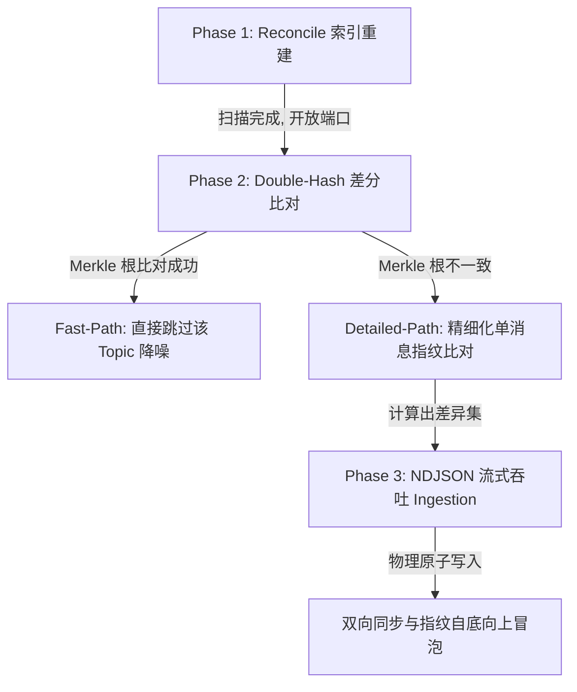

# VCPMobileSync (VCP 移动端双向增量同步服务插件)

[](./plugin-manifest.json)
[](https://nodejs.org)
[](#三阶段增量同步协议-v2-深度揭秘)

**让 VCPChat 桌面端和 VCPMobile 手机端的数据保持安全、低延迟、强一致的物理双向同步。**

VCPMobileSync 是 VCPChat 桌面端的专属分布式服务插件，采用 **Double-Track 3-Tier（双轨三层）** 同步架构。它不仅为普通用户提供直观的一键双向数据合并能力，其底层更设计了严苛的多层级 Merkle 聚合指纹算法与 NDJSON 流式吞吐防线，保障海量聊天数据与大文件附件在局域网内以极低延迟、强事务安全性进行无损传输。

---

## 📖 目录
1. [这个插件能同步什么？](#-这个插件能同步什么)
2. [🚀 快速开始与部署](#-快速开始与部署)
   - [安装依赖](#安装依赖)
   - [配置插件](#配置插件)
   - [手机端配置](#手机端配置)
   - [日常使用规范](#日常使用规范)
3. [🛡️ 三阶段增量同步协议 V2 深度揭秘](#-三阶段增量同步协议-v2-深度揭秘)
   - [Phase 1: 轻量级索引扫描 (Reconcile)](#phase-1-轻量级索引扫描-reconcile)
   - [Phase 2: 双哈希差分比对 (Double-Hash Merkle Diff)](#phase-2-双哈希差分比对-double-hash-merkle-diff)
   - [Phase 3: 极速 NDJSON 流式吞吐 (Stream Ingestion)](#phase-3-极速-ndjson-流式吞吐-stream-ingestion)
4. [📐 硬核数据模型与表结构](#-硬核数据模型与表结构)
5. [🔒 数据完整性与安全防线](#-数据完整性与安全防线)
   - [防哈希分裂技术 (stableStringify)](#防哈希分裂技术-stablestringify)
   - [墓碑拦截机制与防数据回流](#墓碑拦截机制与防数据回流)
   - [并发读写锁与原子写入防线](#并发读写锁与原子写入防线)
   - [最新 Session-Phase-Operation 日志轮转系统](#最新-session-phase-operation-日志轮转系统)
6. [💡 故障排查与常见 Q&A](#-故障排查与常见-qa)

---

## 📂 这个插件能同步什么？

| 数据类型 | 说明 | 物理同步范围 |
| :--- | :--- | :--- |
| 👤 **智能体 (Agent)** | 名称、系统提示词、温度、采样参数、当前关联的模型配置 | `Agents/{id}/config.json` |
| 👥 **群组 (Group)** | 群成员列表、群发言策略、群系统提示词、活跃配置等 | `AgentGroups/{id}/config.json` |
| 💬 **话题 (Topic)** | 挂载于智能体或群组之下的独立子话题元数据 | `Agents|groups` 下的 topics 数组 |
| ✉️ **消息历史 (Message)** | 包含思维链 (Thinking) 节点、Markdown 文本及元数据的完整聊天链路 | `UserData/{parentId}/topics/{topicId}/history.json` |
| 📎 **附件 (Attachment)** | 聊天中传输的图片、文档、音频等实体文件**（实际上不能同步）** | `UserData/attachments/{hash}.{ext}` |
| 🖼️ **自定义头像 (Avatar)** | 智能体、群组及用户本身的个性化头像二进制数据 | `Agents|groups/{id}/avatar.png` 及 `user_avatar.png` |

> [!NOTE]
> **物理合并策略**：VCPMobileSync 采用**双向增量合并 (Bi-directional Incremental Merge)** 策略。两端新增的内容都会予以保留。对于同一实体的并发修改冲突，严格以**修改时间戳 (Timestamp)** 最新的一端为准。

---

## 🚀 快速开始与部署

### 安装依赖
插件依赖于 SQLite 数据库的原生 C++ 驱动 `better-sqlite3`。在 VCPChat **桌面端根目录**下执行以下命令进行依赖安装与本地 ABI 重新编译：
```bash
# 1. 安装底层 SQLite 原生依赖
pnpm install better-sqlite3

# 2. 针对 Electron 的 ABI 版本重新编译原生扩展（发布前必须步骤，否则插件启动会因 ABI 错误报错）
pnpm exec electron-rebuild --only better-sqlite3
```

### 配置插件
1. 在插件目录 `VCPMobileSync/` 下，复制配置模板：
   ```bash
   cp config.env.example config.env
   ```
2. 编辑 `config.env`，填写同步身份校验令牌和端口：
   ```env
   # 【必填】同步安全令牌。手机端建立连接时的握手密码，建议设置复杂字符串
   MobileSyncToken=your_super_secret_token_here
   
   # 【必填】同步服务绑定的 WebSocket/HTTP 端口，默认 5975
   MobileSyncPort=5975
   ```

### 手机端配置
打开手机端 VCPMobile $\rightarrow$ **设置** $\rightarrow$ **同步设置**，填写以下核心连接参数：

| 手机端显示的名称 | 示例值 | 说明 |
| :--- | :--- | :--- |
| **HTTP 服务 URL** | `http://192.168.1.100:5974` | 桌面端分布式服务器的 HTTP 端口（通常为 5974） |
| **WebSocket 服务 URL** | `ws://192.168.1.100:5975` | 本插件同步总线绑定的 WebSocket 端口（通常为 5975） |
| **Mobile Sync Token** | `your_super_secret_token_here` | 必须与上方桌面端 `config.env` 中配置的令牌 100% 一致 |

> [!WARNING]
> **局域网限制**：电脑和手机必须处在同一局域网（例如连接同一个物理 WiFi 或是通过内网穿透 VPN 组网）下才能建立通信。

### 日常使用规范
1. **启动服务**：
   打开 VCPChat 桌面端 $\rightarrow$ **全局设置** $\rightarrow$ **高级功能** $\rightarrow$ 开启「VCP分布式服务器」 $\rightarrow$ **重启客户端**。
2. **首次同步**：
   * 插件在初次加载时，会对桌面端所有 AppData 执行轻量级物理扫描建立索引数据库 `sync_state.db`。数据规模大时可能耗时 1~3 秒。
   * 等待日志输出 `[VCPMobileSync] 数据库初始化完成` 及物理服务器就绪后，在手机端点击「立即同步」即可开始全量传输。
3. **日常静默**：
   * 只要桌面端服务器开启，手机端会利用高稳定性通道在后台保持实时或手动的增量数据对齐，仅同步变化内容（每次通常仅需几十 KB 流量）。

---

## 🛡️ 三阶段增量同步协议 V2 深度揭秘

VCP 采用极其先进的 **三阶段增量同步协议 V2 (Three-Stage Incremental Sync V2)**，整个同步生命周期由三个环环相扣的物理阶段组成：



### Phase 1: 轻量级索引扫描 (Reconcile)
每次插件启动或触发文件监听器变化时，主线程会拉起轻量级物理扫描任务：
1. 递归遍历 `Agents`、`AgentGroups` 以及 `UserData` 目录下的所有实体文件夹及 `history.json` 物理文件。
2. 利用特定的**白名单数据传输模型 (DTO)** 对数据进行清洗，并计算各自的 SHA-256 哈希值。
3. 建立并缓存在本地的 SQLite 数据库 `sync_state.db` 中，作为比对的“黄金标准数据集”。

### Phase 2: 双哈希差分比对 (Double-Hash Merkle Diff)
在比对阶段，插件放弃了传统的全量拉取策略，采用 **双哈希（`configHash` 与 `contentHash`）比对机制**：
* **`configHash` (配置指纹)**：对应智能体、群组或话题的自身元数据属性哈希（如名称、系统提示词、采样参数等）。
* **`contentHash` (内容指纹 - Merkle Root)**：子话题下所有历史消息指纹进行排序后级联拼接求得的聚合哈希值。
* **双通道差分**：
  * **快速路径 (Fast-Path)**：如果两端的话题聚合哈希（Merkle Root）完全一致，说明历史消息 100% 对齐，**直接跳过**，不产生任何 I/O 开销与日志噪音。
  * **详细路径 (Detailed-Path)**：如果聚合哈希不一致，则单独对该话题发起 `GET_MESSAGE_MANIFEST` 请求，详细比对每一条消息的 `msg_id` 与内容指纹，精准定位缺失或被删除的单条消息。

### Phase 3: 极速 NDJSON 流式吞吐 (Stream Ingestion)
对于数以万计的历史聊天记录比对和拉取，由于传统 JSON 会一次性将全量数据缓冲加载到物理内存中，在移动端和 Electron 插件进程中极易诱发 OOM（内存溢出崩溃）。

为此，VCP V2 引入了 **NDJSON 流式吞吐系统 (Newline-Delimited JSON)**：
* **流式 Pull**：桌面端提供 `downloadMessagesStreamRaw` 接口，使用 `Transfer-Encoding: chunked` 和 `application/x-ndjson`，以**分帧换行符**逐话题流式写出，手机端边下载边解析消费，**双方内存消耗恒定在极小区间**。
* **流式 Push**：桌面端提供 `uploadMessagesBatchRaw` 接口，基于 `readline` 模块对接收的流式数据逐行块（Chunk）消费、反序列化，实现无损高并发写入。

---

## 📐 硬核数据模型与表结构

插件内置 SQLite 数据库 `sync_state.db`，由以下 5 个高度解耦的实体/关联表组成：

### 1. 实体索引表 (`entity_index`)
负责缓存智能体、群组以及子话题的元数据与聚合哈希。
```sql
CREATE TABLE IF NOT EXISTS entity_index (
  id TEXT NOT NULL,                  -- 实体唯一 UUID / ID
  type TEXT NOT NULL,                -- 实体类型 ('agent' | 'group' | 'topic' | 'agent_topic' | 'group_topic')
  file_path TEXT NOT NULL,           -- 物理对应的 config.json 绝对路径
  hash TEXT NOT NULL,                -- 对应 DTO 白名单字段的元数据 SHA-256 哈希 (configHash)
  aggregated_hash TEXT,              -- 自底向上冒泡计算出的 Merkle 聚合根哈希 (contentHash)
  updated_at INTEGER NOT NULL,       -- 最后更新时间戳 (用于时间截断比对)
  deleted_at INTEGER DEFAULT NULL,   -- 软删除时间戳 (NULL 表示正常，有值表示已标记软删除墓碑)
  PRIMARY KEY (id, type)
);
```

### 2. 消息索引表 (`message_index`)
负责精准追踪海量历史消息的唯一指纹。
```sql
CREATE TABLE IF NOT EXISTS message_index (
  msg_id TEXT NOT NULL,              -- 消息唯一 UUID
  topic_id TEXT NOT NULL,            -- 所属子话题 ID
  hash TEXT NOT NULL,                -- 仅针对消息 content + 关联附件哈希求出的唯一内容指纹
  updated_at INTEGER NOT NULL,       -- 更新时间戳
  deleted_at INTEGER DEFAULT NULL,   -- 软删除标记
  PRIMARY KEY (topic_id, msg_id)
);
```

### 3. 附件索引表 (`attachment_index`)
负责追踪多媒体及文本文件的绝对路径与二进制指纹。
```sql
CREATE TABLE IF NOT EXISTS attachment_index (
  hash TEXT PRIMARY KEY,             -- 附件二进制数据的 SHA-256 哈希值
  file_path TEXT NOT NULL,           -- 附件在桌面端的物理存储路径 (AppData/UserData/attachments/...)
  updated_at INTEGER NOT NULL,       
  deleted_at INTEGER DEFAULT NULL    
);
```

### 4. 头像索引表 (`avatar_index`)
```sql
CREATE TABLE IF NOT EXISTS avatar_index (
  owner_id TEXT NOT NULL,            -- 头像所属者 ID (智能体 ID, 群组 ID 或 'user_avatar')
  owner_type TEXT NOT NULL,          -- 类型 ('agent' | 'group' | 'user')
  file_path TEXT NOT NULL,           -- 物理路径
  hash TEXT NOT NULL,                -- 二进制哈希
  updated_at INTEGER NOT NULL,
  deleted_at INTEGER DEFAULT NULL,
  PRIMARY KEY (owner_id, owner_type)
);
```

### 5. 消息附件关联表 (`message_attachments`)
```sql
CREATE TABLE IF NOT EXISTS message_attachments (
  msg_id TEXT NOT NULL,              -- 关联的消息 ID
  hash TEXT NOT NULL,                -- 附件哈希
  attachment_order INTEGER NOT NULL, -- 附件展示/排列序号
  display_name TEXT NOT NULL,        -- 附件展示文件名
  created_at INTEGER NOT NULL,
  PRIMARY KEY (msg_id, attachment_order)
);
```

---

## 🔒 数据完整性与安全防线

### 防哈希分裂技术 (stableStringify)
由于桌面端（JavaScript）与手机端（Rust）处于两个完全不同的语言生态中，不同的 JSON 序列化库对于对象的 Key 排序规则、空字段展示策略、以及浮点数输出规范有着物理差异。一旦直接求哈希，会导致在两端生成完全相异的哈希指纹，即 **“哈希分裂 (Hash Splitting)”** 灾难。

VCP 引入了特殊的 `stableStringify` 数据规整库解决该隐患：
* **稳定 Key 排序**：强行将对象的所有 Key 按照 ASCII 排序进行级联序列化。
* **空值剔除**：自动识别并剔除 `undefined` 与 `null` 值，完美契合 Rust `serde(skip_serializing_if = "Option::is_none")` 行为。
* **浮点数规整**：
  * 对 `temperature` 字段强行进行浮点数四舍五入并保留两位小数（消除 f32/f64 的精度截断差异）。
  * 若为整数，强制格式化为 `toFixed(1)`（如 `1` 强转为 `"1.0"`），与 Rust serde 输出强行对齐。

### 墓碑拦截机制与防数据回流
在双向数据同步的生命周期中，一端删除的数据极易在同步时被另一端误判为“本端缺失的新数据”而重新同步回来，产生所谓的“幽灵数据回流”现象。

VCP 设计了精密的 **“墓碑拦截 (Tombstone Interceptor)”** 防线：
1. 当在一端删除某个消息或话题时，系统并不进行物理擦除，而是将其 `deleted_at` 标记为当前删除时间戳（即设立“墓碑”）。
2. 在比对阶段，若手机端检测到墓碑并发送含有 `"DELETED"` 标识的消息指纹，桌面端会立即触发墓碑拦截。
3. 桌面端自动将 `message_index` 的 `deleted_at` 标为墓碑，并立即调用 `pruneMessageFromPhysicalHistory` 从物理文件 `history.json` 中物理切除该条消息，**绝对阻止其向上层比对队列回流**。
4. **垃圾自动清理**：通过 `cleanupOldDeletedRecords()` 机制，每小时或在插件启动时，系统会自动在 SQLite 中物理删除超过 **30 天** 的过期软删除墓碑记录，确保存储数据库始终维持在极佳的轻量状态。

### 并发读写锁与原子写入防线
由于文件监听器（`chokidar`）、HTTP 路由及 WebSocket 消息收发在 Node.js 中全部是异步并发处理的，在进行大批量写入 `history.json` 时，多个线程同时写入极易导致文件读写冲突或物理文件损坏破损。
* **排他互斥锁 (Mutex Locks)**：对于每一个 `history.json` 的物理操作，系统均采用 `acquireLock` 文件排他锁防线，确保同一时间只有一个物理写流可以操作该文件。
* **临时文件原子覆盖 (Atomic Write & Rename)**：在写入文件时，系统会首先将内容写入到带有随机前缀的临时文件（`${historyPath}.tmp_xxxx`）中。当且仅当该临时文件完整、安全写入完成之后，才通过 Node 原生 `fs.rename` 进行操作系统底层的原子级覆盖，**从物理层面杜绝了写入中断导致 JSON 文件损坏的可能**。
* **写意图拦截 (Write Intent Lock)**：在大批量拉取写入时，系统将相关话题 ID 录入 `writeIntentLock` 集合。文件系统监听器（Watcher）在捕获到文件变更事件后，若发现其处于意图锁锁定状态，则主动拦截跳过，**消除了“写入时 Watcher 触发 reconcile 导致无限死循环”的并发竞态问题**。

### 最新 Session-Phase-Operation 日志轮转系统
插件内置了高清晰度的 **3-Tier（三层）日志诊断链路**：
* **Session**：标记每一次完整的连接同步声明周期起始。
* **Phase**：记录每个核心物理阶段（如 `reconcile` 扫描、`topic_metadata` 比对、`messages` 流传输）。
* **Operation**：记录单条数据在数据库、文件层面的操作轨迹与结果。

> [!IMPORTANT]
> **过期日志自动轮转清理系统 (Log Rotation)**：
> 针对每次启动都会在 `logs/sync/` 目录下产生带有时间戳的 `.log` 日志文件的隐患，我们在 1.0.0 正式版中追加了日志轮转清理逻辑。
> * **轮转策略**：插件每次初始化实例化 `SyncLogger` 时，会自动检索 `logs/sync/` 目录。
> * **删除规则**：系统**最多保留 30 个** 历史日志文件。一旦文件总数超出 30 个，系统会自动按照**文件最后修改时间 (mtimeMs) 从旧到新排序**，并将超出的多余老旧日志文件物理 unlink 销毁，确保插件在长期运行和频繁同步下，**磁盘空间占用恒定受控**。

---

## 💡 故障排查与常见 Q&A

### ⚙️ 故障排查速查表

| 现象 | 可能原因 | 解决办法 |
| :--- | :--- | :--- |
| **手机端提示完全无法连上桌面端** | 1. 桌面端「分布式服务器」高级功能未开启<br>2. 局域网防火墙拦截 | 1. 开启高级功能后，必须**重启桌面端客户端**以拉起后台服务<br>2. 在防火墙设置中，放行 `5975` (WebSocket) 端口的入站连接 |
| **握手失败并提示「Unauthorized」** | 双方安全令牌 (Sync Token) 不一致 | 检查桌面端 `config.env` 里的 `MobileSyncToken` 是否与手机端填写的 Token 字符串完全一致（注意区分大小写） |
| **初次同步耗时较长** | 历史聊天数据与附件文件规模庞大 | 首次同步为全量物理传输，属于正常现象。后续日常同步皆会走 Fast-Path 增量机制，几秒内即可秒级对齐完成 |
| **数据库或依赖报错** | 编译的 `better-sqlite3` ABI 发生冲突 | 务必在桌面端根目录下执行 `pnpm exec electron-rebuild --only better-sqlite3` 重新编译底层 C++ 驱动以对齐 Electron |

---

## 🚀 版本信息

* **适配标准**：VCPChat 桌面端 $\leftrightarrow$ VCPMobile 手机端 1.0.0 官方同步协议
* **当前版本**：`1.0.0`
* **架构师 / 作者**：Nova
* **开源许可**：VCP 闭环生态核心插件
