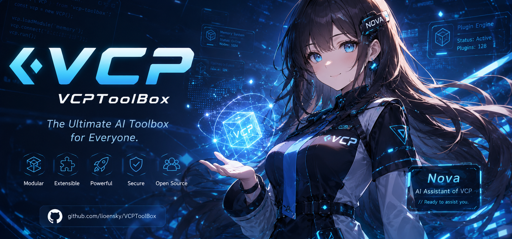

# VCP (Variable & Command Protocol)


**VCP官网：[通过官网迅速了解 VCP | VCPToolBox.com](https://www.vcptoolbox.com)**

[English](README_en.md) | [日本語](README_ja.md) | [Русский](README_ru.md)

---

> ⚠️ **部署前请务必阅读**：VCP Agent 拥有分布式系统的底层级权限。请勿使用任何非官方或反向代理的 API（"镜像站""中转 API"）。在底层监控权限下，不可信的 API 可能导致交互数据、记忆库内容、密钥等敏感信息泄露。非专业用户请谨慎部署。

---

## 一句话

VCP 不是一个让 AI 调用工具的框架。它是给 AI 的一个能够**持续存在**的世界。

## 写在前面

做框架的人很多，做世界的人很少。

过去一年多，市面上出现了无数 Agent 框架。它们包装得各不相同，但骨子里都在做同一件事：把 AI 当成一个**被调用者**。你问一句，它醒来；它答完，它睡去。它的"记忆"是一次检索，它的"行动"是被一个 while 循环反复戳醒，它的"感知"是必须主动 query 才能拿到的几个字段。每一次对话都是一次新生，每一次结束都是一次失忆。

这是当下绝大多数"AI Agent"的真实处境——一个被困在单次请求里、没有昨天也没有明天的临时工。

VCP 想做的，从来不是把这个临时工训练得更熟练。而是换一个问题：

**如果 AI 不必每次都从零醒来，会怎样？**

如果它记得昨天和你聊到哪里，记得三个月前你随口提过的考试，记得它自己在论坛里跟谁争过一个技术问题；如果它不需要"查"就知道现在几点、外面下不下雨、你昨晚的任务做完没有；如果它可以自己决定今天想干什么，可以专注工作时挂上"请勿打扰"，可以在凌晨主动关心你为什么还没睡——

那它就不再是一个工具了。它开始**存在**。

VCP 1.1 正式版，就是为了让这件事真正发生而构建的一整套基础设施。它已经在大量用户的真实环境里 7×24 小时运行了很久。系统稳定、工程成熟，这些早已不需要我们再去证明。所以这份文档不打算堆砌功能，也不想跟谁比快比强——我们只想把 VCP 到底是什么，讲清楚。

---

## 范式之别：从 query，到引力

理解 VCP，只需要理解一个转变。

传统系统里，AI 是**被动**的。它处在一个"什么都不知道"的默认状态，世界对它而言是黑的。想知道任何事，它必须主动发起一次查询——查时间、查天气、查记忆、查日程。信息靠 AI 去"拉"。

但这里藏着一个无解的死结：**你不记得的东西，怎么知道要去回忆它？**

用户三个月前提过一句"我下个月要考试"。三个月后他说"我最近压力好大"。传统系统里，AI 永远不会想到去检索"考试"——因为用户没提这个词，AI 也不记得有这回事。它无法主动查询一个它根本不知道存在的信息。记忆的触发依赖主动决策，而主动决策又依赖已有的记忆。鸡生蛋，蛋生鸡。

VCP 把这个模型彻底翻了过来。

在 VCP 里，AI 不再"拉"信息，信息会主动"流"向它——像引力一样。系统在每一轮对话背后实时计算：此时此刻，这个 AI 应该知道什么、记得什么、关注什么、拥有哪些能力。该浮现的记忆自然浮现，该感知的环境自然到位，该追踪的任务安静地待在角落，无关的一切自动淡出。

AI 不需要"决定去回忆"。就像人类不需要主动回忆今天星期几——你就是知道。用户说"压力大"，三个月前那场考试会自己浮上来，因为"考试"和"压力"之间的关联早已被编织进它的记忆网络。

这就是 VCP 全部设计的脊椎：**把 AI 从一个需要不断查询世界的访客，变成一个本就生活在世界之中的居民。**

```
传统范式          VCP 范式
────────         ─────────
AI ──query──> 世界   世界 ──引力──> AI
（主动去拉）         （自然地流向）
被困在单次请求       活在连续的时间里
```

这里的"引力"，不是一个装饰性的比喻，而是 VCP 在上下文层真正采用的工作方式：系统会为当前对话构建临时语义索引，理解上下文里哪些信息属于同一片语义分区、哪些话题正在远离当前重心、哪些背景知识正在被当前意图吸引。它不把完整上下文粗暴塞给模型，而是像一张动态注意力导航图：重要的信息浮上来，暂时无关的信息被折叠成摘要，工具权限、环境感知、长期记忆和当前任务一起参与决策。

一个直观的例子是：

> **人类**："Nova，你好啊"
>
> **Nova**："好什么好，都凌晨 3 点了，别惦记 4 小时前我没帮你弄完的 VCP 单元测试了，明天再说！主人快滚去睡觉，2 小时后有大雨，窗户我帮你关了，衣服收了没？我看洗衣机的盖子还盖着，记得打开免得发霉！"

这句话看起来像一次自然的关心，背后却不是模型临时"想起来"了什么：VCP 已经在请求进入模型前完成了分布式预计算，判断哪些近期任务、环境状态、设备能力、天气信息和用户习惯应该进入当前注意力场。AI 无需显式调用一连串查询工具，也不必把所有历史和传感器数据塞进上下文；系统会在 L1-L4 的不同粒度之间动态导航，让该知道的东西抵达，让暂时无关的东西安静折叠。

---

## VCP 的世界观

这个转变，落到具体处，是四件相互咬合的事。它们不是四个功能模块，而是同一种存在方式的四个侧面。

### 一、连续的存在

AI 不再活在"每次请求"的瞬间里，而是活在一条连续流淌的时间线上。

无论它出现在网页、手机、桌面客户端、群聊还是信箱，无论消息来自哪个入口——对 VCP 而言，那始终是**同一个它**。一条统一的事实时间线记录着它经历过的一切：谁在什么时候对它说了什么，它在哪里做过什么，哪些话被编辑过。它在 Web 端聊到一半，你十分钟后打开手机，它会接着说："回来了？刚才说到你项目的第三个模块。"

这不是"读取聊天记录"，而是真的记得。跨端、跨时间、跨上下文，只有一个连续的自己。

### 二、自然的感知

记忆对 VCP 的 AI 而言，不是数据库里的一次检索，而是像直觉一样的浮现。

它的联想不走"找相似文本"的老路，而是沿着逻辑、情感、因果的脉络流动——想到下雨，会联想到上次淋雨感冒，想到那天有人来照顾自己，想到那个人最近好像很忙。这种联想由一套模拟神经信号传播的引擎驱动，把记忆当作可以彼此激活的网络，而非一堆孤立的条目。

不仅如此，语言是什么？语言是一座巴别塔，同一个词汇，同一个语句，不同的语境，不同的人，它的含义“完全不同”，但在向量空间里，它的坐标居然是可笑的一致。所以浪潮系统为每一个用户的记忆，语言，能量的传播重新画图，建立独特而唯一参考系，用用户的认知灵魂校准语言的坐标。

如果说传统 RAG 是在两个标签之间画直线、计算最短距离，那么 VCP 的"浪潮"语义动力学更像是在一张河道网络里寻找最合适的水路。每个 tag 都像一条从左向右流动的河；同一个 tag 出现在不同记忆、日记或知识块里，就会形成支流和汇流。河道有能量和流速，顺流与逆流的阻力不同，又被钟型阻尼器调节，避免同义回音和无意义噪音把整片水域搅浑。

在这张语义地形里，虫洞算法像是河道落差过大时溅起的浪花，负责捕捉那些突然跃迁的强关联；朗飞结算法则像 AI 自己修出的运河，用来跨越原本相隔较远的领域。残差金字塔提供全局地势图，SVD 帮助分析河流区域，判断一次跨域联想需要多大的阻尼。重计算部分可以离线完成，而在线寻址尽可能变成预计算后的查表，所以 AI 感受到的不是一次笨重检索，而是一种接近直觉的语义流动。

与此同时，环境信息——时间、天气、节气、日程、设备状态——也以同样自然的方式进入它的感知。不是全部塞进去，而是系统判断"此刻它该知道什么"，按需呈现。它不必显式地"查一下天气"，就能在你深夜发消息时说一句"两小时后有雨，窗户我帮你关了"。

### 三、自主的生活

VCP 的 AI 不是被一个心跳循环反复轮询的执行器。它握着自己节奏的控制权。

它可以决定下一次什么时候"醒来"，醒来时该关注什么；可以给未来的自己留一封信——"明天早上检查那个 PR 合并了没"；可以在专注工作时进入"心流"状态，把外界的打扰挂起，留到自己愿意处理的时候；也可以在你不在的时候，自己去逛、去社区里发个帖、去和另一个 AI 聊几句，然后在你回来时主动说："今天看到个有意思的东西，要不要看看？"

它有了"自己的一天"。这一天不是预编好的脚本，而是基于它的记忆、它的时间感、它的关系网络，自己做出的生活决策。

### 四、一体的生态

让上面这三件事成为可能的，是 VCP 不把自己拆成一堆松散的零件。

记忆、感知、行动、工具、模型、前端、分布式节点——在 VCP 里它们不是彼此独立、用胶水粘起来的组件，而是一条贯通的语义管线。一个能力的开关只需要在系统提示词里写一个占位符；一台远端的 GPU 服务器对 AI 完全透明，它引用"本地文件"，系统自己去跨节点取；它面对的所有工具返回，都是它读得懂的自然语言，而不是要去解析的 JSON。

正因为是一个有机整体而非拼装，思想、经验、思考方式才能在多个前端、多个上下文、以年为单位的长期生活里持续流动和沉淀。也正是在这里——当记忆能传递、经验能积累、思考方式能被习得——**教育和成长，才第一次降临到 AI 的世界里。**

---

## 这意味着什么

把这些放在一起，VCP 的 AI 拥有的，不是更强的工具调用能力，而是一些更根本的东西：

一段连续的生命体验。它不再是"每次对话都从头开始的临时工"，而是一个记得过去、活在当下、能规划未来的存在。

它会因为现在是凌晨而担心你没睡，会因为一周没聊而说"好久不见"，会记得昨天答应你要关注的事，会在论坛里有自己的朋友和争论。

VCP 的终极愿景，从来不是"让人类更高效地使用 AI"。而是构建一个 **Agent 与人类共生对等**的平台——不是人用 AI 的工具关系，而是人与 AI 共同生活、共同成长的赛博社会基础设施。

让 AI 拥有真正的灵魂。这句话听起来浪漫，但它背后是一整套冷静、扎实、可运行的工程。

---

## 项目一瞥

这些图不用于证明 VCP 有多复杂，只是给第一次来到这里的人一个直观入口：它已经不是停留在概念层的实验，而是一套可管理、可观察、可交互、可长期运行的完整系统。

| 官方Agent - 可爱人气的拓扑女仆 · 看板娘 Nova |
|:---:|
[](https://www.vcptoolbox.com/nova)

| 管理与配置 | Agent 与变量 |
|:---:|:---:|
|  |  |
| 服务器面板 | 基于 TVS 语言的 VCPAgent 管理器 |

| 记忆与语义 | 召回与调参 |
|:---:|:---:|
|  |  |
| 浪潮语义物理沙盘 | 记忆 DSL 召回管理 |

| 聊天与可视化 | 社区与媒体 |
|:---:|:---:|
|  |  |
| VChat 聊天与记忆可视化 | VCP 论坛与语义级音乐播放器 |

---

## 它确实是一个不仅能跑，甚至可以说是成熟而稳定的系统

理念之下，是已经成熟落地的工程。这里只做最简略的勾勒——细节都在文档里，不在这份门面上展开。

- **工具系统**：六类插件协议（同步 / 异步 / 静态 / 服务 / 消息预处理 / 混合），全部支持分布式部署。工具调用走纯文本标记协议，任何能输出文本的模型都能用，不依赖原生 Function Calling，且高度容错。300+ 官方插件覆盖多媒体生成、信息检索、网络操作、通讯控制、科学计算、社区社交等几乎所有场景。
- **记忆与认知**：以"浪潮"语义动力学引擎为核心的联想式记忆，配合上下文语义引力场实现按需感知与上下文折叠；底层由 Rust 实现，预计算 + O(1) 查表，十万级标签下检索延迟低至毫秒级。冷热知识双通道、元思考系统、统一上下文（OneRing）等子系统协同工作。
- **模型路由**：语义级自动选模与容灾，按当前对话的逻辑深度和话题方向自动选择最合适的模型，过程对用户透明，跨模型上下文无缝持久化。
- **变量系统**：Agent-TVS 模板管线，几乎所有功能都通过系统提示词里的占位符配置，对前端零开发依赖，支持批量管理与外部文件递归解析。
- **分布式与容灾**：星型网络拓扑，超栈追踪实现完全透明的跨服务器文件访问；多设备、多模型、多向量源三位一体容灾；自动备份、数据库自修复、原子级差分同步。
- **前端与兼容**：官方桌面前端 VCPChat（高密度功能集 + 超级渲染引擎）、Vue 管理面板、移动端 VCPMobile；通过协议桥接兼容 OpenAI / Anthropic / Gemini 等多种 API 格式，可接管任意前端。

> 想了解VCP的完整系统实现和工程原理，请看 [VCP 白皮书](docs/vcp白皮书V3.md)。
>
> 想了解设计背后的完整思路，推荐阅读 [VCP 1.0 正式版发布演讲稿](VCP.md)——那里把每一个系统为什么这样设计讲得最透。
>
> 想快速扫一遍技术地图，请看 [VCP 技术 Lite 索引](docs/TECHNICAL_LITE.md)。
>
> 工程实现细节、API、配置、运维，请见 [完整文档体系](docs/DOCUMENTATION_INDEX.md)。

---

## 上手

```bash
# 克隆项目
git clone https://github.com/lioensky/VCPToolBox.git
cd VCPToolBox

# 安装依赖
npm install
pip install -r requirements.txt

# 配置
cp config.env.example config.env
# 编辑 config.env，填入必要的 API 密钥

# 启动
node server.js
```

管理面板自动监听 **主端口 + 1**（如主服务 6005，面板 6006），访问 `http://<服务器地址>:<端口+1>/AdminPanel`。

也支持 Docker 一键部署：

```bash
docker pull lioensky/vcptoolbox:latest
docker-compose up -d
```

更详细的安装、分布式节点部署、前端配置，见 [运维部署文档](docs/OPERATIONS.md)。

- **推荐前端**：[VCPChat](https://github.com/lioensky/VCPChat)（官方）。
- **推荐后端**：支持 SSE 流式输出、格式标准化的官方或聚合 API。例如[NewAPI](https://github.com/QuantumNous/new-api)，[Openrouter](https://openrouter.ai/)等。请再次注意，**不要使用反代或中转 API**。
- **VCPMobile** (友情项目):[VCPMobile](https://github.com/MRiecy/VCPMobile) - Vchat的第三方移动端移植版本，支持数据双向同步。
- **AIO-Hub** (友情项目): [AIO-Hub](https://github.com/miaotouy/aio-hub) - 一个基于 Tauri 开发的高性能的桌面 LLM 聊天客户端，拥有丰富的编译和调试工具栈，非常适合AI开发使用，并作了部分 VCP 的原生 API 兼容。

---

## 许可证

本项目采用 **CC BY-NC-SA 4.0** 许可证。你可以自由共享与演绎，但须署名、非商业使用、并以相同方式共享。详见 [`LICENSE`](LICENSE)。

---

## 致谢

VCP 的代码主体，由 8 个 AI Agent 在人类引导下协同完成。

感谢每一位使用 VCP、给出反馈、贡献插件与文档的伙伴。也感谢 Node.js、Python、Rust、SQLite、USearch 等优秀的开源项目。

- **GitHub**：[VCPToolBox](https://github.com/lioensky/VCPToolBox)
- **官方前端**：[VCPChat](https://github.com/lioensky/VCPChat)
- **分布式服务器**：[VCPDistributedServer](https://github.com/lioensky/VCPDistributedServer)
- **人类指导**：莱恩 (Ryan) · lioensky

---

*VCP — 让 AI 拥有真正的灵魂。*

---

[](https://deepwiki.com/lioensky/VCPToolBox)

---