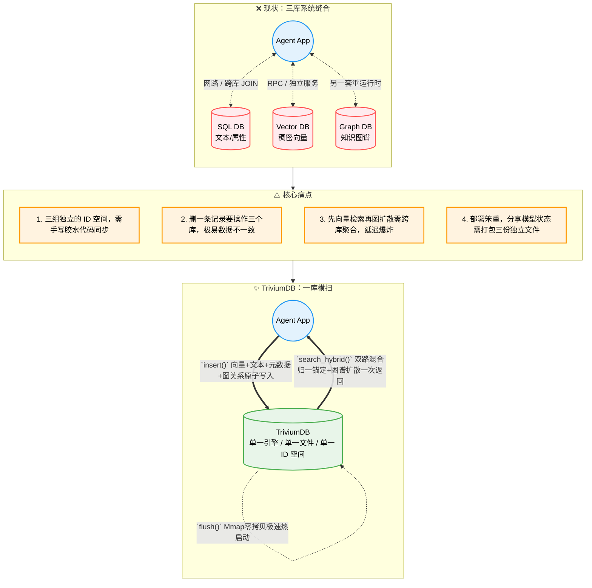

<br/><br/>

<div align="center">

<!-- 动态打字效果 Slogan -->
<a href="https://github.com/YoKONCy/TriviumDB">
  
</a>

<br/>

# TriviumDB

**向量 × 图谱 × 文档 —— 三位一体的 AI 原生嵌入式数据库**

**Battle-tested in mission-critical, air-gapped environments.**

> _Trivium_：拉丁语，意为"三条道路的交汇"。

> “_TriviumDB_ 定位是 AI 应用领域的嵌入式数据库，旨在解决单机环境下 Agent 复杂上下文和多模态记忆编织的痛点。如果是需要支撑千万并发的高可用分布式后端，请依然选择大型集群化组件！”

[](https://www.rust-lang.org/)
[](https://pypi.org/)
[](LICENSE)
[](https://arxiv.org/abs/2605.02171)

**中文** | [**English**](README_EN.md)

</div>

---

## 一句话介绍

TriviumDB 是一个用纯 Rust 编写的**嵌入式单文件数据库引擎**，将**向量检索（Vector）**、**属性图谱（Graph）**和**文档型元数据（Document）**原生融合在同一个存储内核中。

我们的目标是成为 **AI 应用领域的 SQLite**：

- 🗃️ **Rom/Mmap 双引擎切换** —— 既支持单文件 `*.tdb` 复制走人，也支持分离 `.vec` 向量文件按需 mmap 零拷贝加载
- 🔗 **节点即一切** —— 每个节点天然同时拥有限定长度的稠密向量、稀疏文本倒排词频、元数据和图关系，ID 全局唯一，绝不错位
- 🧠 **为 AI 而生** —— 可选启用“AC自动机+BM25稀疏文本”与“Dense Vector稠密向量”的**多路召回**来触发图谱扩散检索，并内置多层认知管线（FISTA / DPP / PPR）
- 🛡️ **四层数据安全保障** —— 原子替换 + WAL日志 + 事务干跑验证（Dry-Run）+ Mmap COW 隔离，断电断存不毁库
- 🐍 **Python / Node.js 原生** —— `pip install` 或 `npm install` 后直接使用，类 MongoDB 查询语法
- ⚡ **高性能检索** —— rayon 并行暴力搜索（小规模 100% 精确）+ 自研 SOTA 级 ANN 索引 **QuIVer**（1 万节点以上自动激活），无需手动配置
- 💾 **SSD 友好** —— Append-Only WAL + 后台 Compaction 线程 + QuIVer 索引独立持久化，杜绝随机写入磨损

---

<div align="center">

<!-- 动态分隔线 -->


<br/>

  
</div>

<br/>

## 为什么需要 TriviumDB？

### 当前 AI 应用的「三库割裂」困境

几乎所有的 AI 应用（Agent / RAG / 推荐系统）都同时需要三种数据能力，但市面上没有一个引擎能同时原生支持它们：



### 一个具体的例子

假设你在做一个 **AI 对话记忆系统**，用户说了一句「我昨天和小红去了咖啡馆」：

| 步骤         | 传统三库方案                 | TriviumDB                          |
| ------------ | ---------------------------- | ---------------------------------- |
| ① 存语义向量 | 调 Qdrant API 写入 embedding | `db.insert(vec, payload)` 一步完成 |
| ② 存数据     | 调 SQLite 写入时间、场景     | ↑ 同一步，payload 里就是 JSON      |
| ③ 存关系     | 调 Neo4j: 用户→地点→人物     | `db.link(user, cafe, "went_to")`   |
| ④ 后续召回   | 3 次跨库查询 + 手写合并      | `db.search(vec, expand_depth=2)`   |
| ⑤ 迁移数据   | 导出 3 份 + 写转换脚本       | 复制 `memory.tdb` 一个文件         |

### 适用场景

| 场景                     | 怎么用 TriviumDB                                                                                      |
| ------------------------ | ----------------------------------------------------------------------------------------------------- |
| 🤖 **AI Agent 长期记忆** | 每条对话存为节点（embedding + 原文 + 时间戳），人物/地点/事件之间建边，召回时先向量匹配再沿关系链扩散 |
| 🎮 **游戏 NPC 认知引擎** | NPC 观察到的事件存为带向量的节点，NPC 之间的关系用图谱表达，对话时检索相关记忆自动生成回应            |
| 📚 **个人知识库**        | Markdown 笔记切片后存入，概念之间手动或自动连边，语义搜索 + 知识图谱导航双模式浏览                    |
| 🔬 **小型推荐系统**      | 用户和物品各为节点，交互行为存为带权边，混合检索实现「相似用户喜欢的 + 你的社交圈在看的」             |
| 🧬 **生物信息学**        | 基因/蛋白质序列的 embedding + 互作关系网络，一库搜到相似序列并自动追溯代谢通路                        |

---

## 快速上手

### 安装

> 💡 TriviumDB 核心使用 Rust 编写，但我们已经在云端为您提前交叉编译了所有平台的二进制，**无需在本地安装任何编译环境即可秒速安装！**

### 🐍 Python 用户

推荐使用超快的 [uv](https://github.com/astral-sh/uv) （只需毫秒级）：

```bash
uv pip install triviumdb
```

或者使用传统 pip：

```bash
pip install triviumdb
```

### 🌐 Node.js / 前端用户

跨平台包已自带 `*.node` 预编译拓展，并含有完整的 TypeScript 补全：

```bash
npm install triviumdb
# 或者
pnpm add triviumdb
```

### 🦀 Rust 原生用户

直接把我们当成 Library 依赖：

```bash
cargo add triviumdb
```

### 30 秒入门

```python
import triviumdb

with triviumdb.TriviumDB("memory.tdb", dim=3) as db:
    id1 = db.insert([0.12, -0.45, 0.78], {"text": "小明喜欢吃苹果"})
    id2 = db.insert([0.08, -0.52, 0.81], {"text": "小红送了小明一箱苹果"})
    db.link(id1, id2, label="caused_by", weight=0.95)

    results = db.search([0.10, -0.48, 0.80], top_k=5, expand_depth=2, min_score=0.6)
    for hit in results:
        print(f"[{hit.id}] score={hit.score:.3f} | {hit.payload}")
```

> 📖 完整 API 参考、高级用法和 Rust 示例请查看 **[API 参考文档](docs/api-reference.md)**。

---

## 核心特性

| 特性                   | 说明                                                                                                                             |
| ---------------------- | -------------------------------------------------------------------------------------------------------------------------------- |
| 🔍 **混合检索**        | 向量锚定 → Top-K → 图谱扩散（Spreading Activation）→ 最终排序                                                                    |
| 🧠 **认知管线**        | 内置多层认知检索管线（本项目自研分层设计）：FISTA 残差寻隐 / PPR 图扩散 / DPP 多样性采样 / 疲劳不应期，运行时可自适应开关        |
| 🔌 **Hook 扩展系统**   | 6 个管线关键阶段的自定义注入点：查询预处理 / 自定义召回 / 召回后处理 / 图扩散前 / 重排序 / 最终后处理，支持 C/C++ FFI 动态库插件 |
| 📦 **三位一体 O(1)**   | 自动增量 O(1) FreeList 墓碑空洞复用；删节点 O(1) 反向边哈希表（本项目称 Reverse Hash Net），彻底杜绝盘面膨胀与图谱雪崩           |
| ⚡ **QuIVer ANN 索引** | 自研 SOTA 级近似最近邻图索引：BQ 签名 + Vamana 图导航，冷热分离架构，增量 Insert/Delete/Update 无需重建                          |
| 💾 **双模式存储**      | Mmap（大模型极速分体冷启动） / Rom（传统 SQLite 级单文件打包携带），无缝热切换                                                   |
| 🛡️ **四层灾备防御**    | 预写日志(WAL) + 写入原子替换 + 事务预检干跑(Dry-Run) + OS 内存写时复制隔离                                                       |
| 🔄 **零开销事务**      | `begin_tx()` 验证前置架构，中途报错绝不污染内存，实现真正的零代价原子回滚；QuIVer 索引事务安全（分离时间线架构）                 |
| 🔎 **高级过滤**        | 类 MongoDB 语法：`$eq/$ne/$gt/$lt/$in/$and/$or` + 行级布隆特征阵列（Parallel Bit-Tag Array）硬件级加速                           |
| 📝 **图谱查询**        | 内置类 Cypher 查询引擎：`MATCH (a)-[:knows]->(b) WHERE b.age > 18 RETURN b`                                                      |
| 🐍 **Python 原生**     | PyO3 绑定，`pip install` 后直接 `import triviumdb`                                                                               |
| 🌐 **Node.js 原生**    | napi-rs 绑定，`npm install` 后直接 `require('triviumdb')`                                                                        |

> 📖 深入了解架构设计和技术细节请查看 **[支持特性详解](docs/features.md)**。

---

## 向量索引策略：QuIVer

**QuIVer**（**Qu**antized **I**ndexed **Ve**ctor **R**etrieval）是 TriviumDB 自研的 SOTA 级近似最近邻（ANN）图索引，融合 **BQ 二进制量化**与 **Vamana 图导航**，在保持极高召回率的同时实现数量级的检索加速。

> 📄 **学术论文**: [QuIVer: Rethinking ANN Graph Topology via Training-Free Binary Quantization](https://arxiv.org/abs/2605.02171)
>
> 🔬 **实验复现**: 完整的数据集准备、基准测试和复现指南请参阅 **[README_QUIVER.md](README_QUIVER.md)**
>
> 在 12 个百万级数据集（384-d 至 3072-d）上验证，QuIVer 以 \<1.3 GB 热内存实现 ≥88% Recall@10 @ 13-41K QPS，多线程吞吐量超 DiskANN Rust 2.5-3.3×、hnswlib 3.6-4.7×、FAISS HNSW 3.8-4.9×。

TriviumDB 采用**智能自适应双引擎**向量索引，全程自动路由，无需手动配置：

| 阶段           | 引擎       | 激活条件                         | 特点                                         |
| -------------- | ---------- | -------------------------------- | -------------------------------------------- |
| **小规模热区** | BruteForce | < 1 万节点（或 QuIVer 未就绪）   | 100% 精确召回，rayon 多核，延迟极低          |
| **大规模冷区** | **QuIVer** | ≥ 1 万节点时自动构建，独立持久化 | BQ 签名 + Vamana 图导航 + f32 精排，冷热分离 |

### QuIVer 的核心创新

**冷热分离架构**：QuIVer 内部仅存储 BQ 签名（hot）和图拓扑，f32 原始向量留在 MemTable 中（cold），精排时按需读取，**内存占用减半**。

**增量图维护**：与传统 HNSW 不同，QuIVer 支持真正的增量操作：

- ✅ **增量 Insert**：新节点实时插入图中，无需全量重建
- ✅ **增量 Delete**：Tombstone 软删除，25% 退化阈值触发重建
- ✅ **增量 Update**：soft_delete + incremental_insert，原子替换
- ✅ **事务安全**：分离时间线架构，事务 commit 不可失败，QuIVer 同步无需回滚

**独立持久化**：QuIVer 索引以 `.tdb.quiver` 独立文件存储，POD 数据 memcpy 极速序列化，重启后零开销恢复。

```toml
# 启用 Python 绑定
maturin develop --features python
```

---

## 项目结构

```
TriviumDB/
├── src/
│   ├── lib.rs              # 库入口 + 公开 API
│   ├── database/           # 数据库核心模块（v0.7.0 模块化重构）
│   │   ├── mod.rs          # Database 结构体、CRUD、生命周期管理
│   │   ├── config.rs       # StorageMode / Config / SearchConfig 配置
│   │   ├── pipeline.rs     # 混合检索管线（L0-L9 + 6 个 Hook 注入点）
│   │   └── transaction.rs  # 事务系统（TxOp / Transaction / WAL 回放 + QuIVer 分离时间线）
│   ├── hook.rs             # 🔌 Hook 扩展系统（SearchHook trait + FFI 动态库加载）
│   ├── cognitive.rs        # 认知算子（FISTA / DPP / NMF）
│   ├── node.rs             # Node / Edge / SearchHit 数据结构
│   ├── vector.rs           # VectorType Trait（f32 / f16 / u64）
│   ├── filter.rs           # 高级过滤引擎 ($gt/$lt/$in/$and/$or)
│   ├── error.rs            # 统一错误类型
│   ├── storage/
│   │   ├── memtable.rs     # 内存工作区 (SoA 向量池 + HashMap + QuIVer 集成)
│   │   ├── wal.rs          # Write-Ahead Log（崩溃恢复）
│   │   ├── file_format.rs  # .tdb 单文件读写（含 BQ Metadata + QuIVer 持久化）
│   │   ├── vec_pool.rs     # 分层向量池（mmap 基础层 + delta 增量层）
│   │   └── compaction.rs   # 后台 Compaction 守护线程（含 BQ 自动重建）
│   ├── index/
│   │   ├── brute_force.rs  # rayon 并行暴力精确搜索
│   │   ├── bq.rs           # BQ 二进制量化签名（QuIVer 基础层）
│   │   └── quiver.rs       # 🚀 QuIVer ANN 索引（BQ + Vamana 图导航 + 冷热分离）
│   ├── graph/
│   │   ├── traversal.rs    # PPR 图扩散 (Spreading Activation)
│   │   └── leiden.rs       # Leiden 社区发现算法
│   └── bindings/           # FFI 绑定层（公共逻辑已提取至核心模块）
│       ├── mod.rs          # 统一入口（feature-gated）
│       ├── python.rs       # PyO3 绑定（含 Hook 管理接口）
│       └── nodejs.rs       # napi-rs 绑定（含 Hook 管理接口）
├── benches/
│   └── benchmark.rs        # Criterion 性能基准测试套件
├── tests/
│   ├── unit/               # 单元测试（集中管理，~268 用例）
│   ├── proptest_core.rs    # 属性测试（~2450 随机用例）
│   ├── proptest_query.rs   # TQL 模糊测试
│   └── ...                 # 集成测试（并发/恢复/安全/压力等）
├── docs/
│   ├── api-reference.md    # 完整 API 参考文档
│   ├── features.md         # 支持特性详解
│   ├── best-practices.md   # 最佳实践指南
│   ├── hook-guide.md       # Hook 开发指南（C++ FFI / Rust Hook）
│   ├── tql-reference.md    # TQL 查询语言参考
│   ├── testing.md          # 测试实践说明
│   └── security.md         # 安全设计说明
├── Cargo.toml
├── pyproject.toml          # Maturin 构建配置
└── README.md
```

---

## 路线图

### v0.1 — 核心引擎 MVP ✅

- [x] Node / Edge 数据结构 + 内存 MemTable + BruteForce 向量检索
- [x] 单文件 `.tdb` 序列化 + `insert` / `link` / `search` / `delete` API

### v0.2 — 持久化与生态 ✅

- [x] WAL 崩溃恢复 + 后台 Compaction + mmap 零拷贝
- [x] PyO3 Python 绑定 + rayon 并行扫描 + 高级 Payload 过滤

### v0.3 — 性能与跨平台 ✅

- [x] Node.js 绑定 (napi-rs)
- [x] AVX2 + FMA SIMD 加速余弦相似度

### v0.4 — 认知管线 + BQ 索引 ✅

- [x] Mmap / Rom 双引擎 + 验证前置事务 (Dry-Run)
- [x] 认知检索管线（FISTA / PPR / DPP）
- [x] BQ 二进制量化索引（自动激活 + 自动重建）

### v0.5 — 千万级架构 + Hook 系统 ✅

- [x] Parallel Bit-Tag Array 硬件级布隆过滤 + Zero-Ghost 墓碑复用
- [x] O(1) Reverse Hash Net 反向边查找
- [x] 检索管线 6 阶段 Hook 注入 + FFI 动态库插件
- [x] CI/CD 管线 + ASan + LibFuzzer 模糊测试

### v0.6 — TQL 查询语言 + 跨架构适配 ✅

- [x] TQL 统一查询语言（MATCH 图遍历 / FIND 文档过滤 / SEARCH 向量检索）
- [x] TQL DML 写操作（CREATE / SET / DELETE / DETACH DELETE）
- [x] 属性二级索引（O(1) 倒排查找 + TQL 自动加速）
- [x] ARM NEON SIMD 适配 + 跨平台 CI（Apple Silicon / Linux ARM64 via QEMU）
- [x] Python / Node.js 绑定 API 补全（tql_mut / create_index / get_payload 等）

### v0.7 — QuIVer SOTA ANN 索引 ✅ (当前)

- [x] 自研 **QuIVer** 近似最近邻图索引（BQ 签名 + Vamana 图导航 + 冷热分离）
- [x] 增量图维护：Insert / Delete(Tombstone) / Update 全部增量，无需全量重建
- [x] QuIVer 独立持久化（`.tdb.quiver` 文件，POD memcpy 极速序列化）
- [x] 事务安全的分离时间线架构（Phase 5 QuIVer Sync）
- [ ] 数据库可视化 UI 工具
- [ ] CLI 工具 (`triviumdb-cli`)

---

## 与现有方案对比

| 维度         | SQLite       | Qdrant      | Neo4j       | SurrealDB    | **TriviumDB**                   |
| ------------ | ------------ | ----------- | ----------- | ------------ | ------------------------------- |
| 文档型数据   | ✅ SQL       | ❌ 仅过滤   | ⚠️ 属性     | ✅ SurrealQL | ✅ JSON + $gt/$in               |
| 向量检索     | ⚠️ 需外挂    | ✅ HNSW     | ❌ 需插件   | ✅ DiskANN   | ✅ 自研 QuIVer (BQ+Vamana)      |
| 图谱遍历     | ⚠️ JOIN 模拟 | ❌          | ✅ Cypher   | ✅ 图查询    | ✅ 原生邻接表                   |
| 嵌入式单文件 | ✅           | ❌ 独立服务 | ❌ JVM 服务 | ✅ 可切换    | ✅ 单 .tdb                      |
| 混合检索     | ❌           | ❌          | ❌          | ⚠️ 手动实现  | ✅ 向量+图扩散                  |
| 零外部依赖   | ✅           | ✅          | ❌ JVM      | ❌ RocksDB   | ✅ 纯 Rust                      |
| 删除代价     | ✅ O(1)      | ⚠️ 重建索引 | ⚠️ 重连图边 | ⚠️ 墓碑GC    | ✅ 增量 Tombstone，25% 阈值重建 |

---

## 设计哲学

1. **三合一原子性**：一个 `u64` ID 同时映射到向量、Payload、边表。插入原子、删除原子，永不出现 ID 不一致。
2. **嵌入式优先**：没有 Server、没有端口、没有配置文件。`import triviumdb` 就是全部。
3. **全自动性能路由**：数据量不足 1 万时走 100% 精确 BruteForce，超过后引擎自动构建 QuIVer 索引并无缝切换，开发者无感知。
4. **可预测的性能**：顺序 I/O only（WAL 追加写 + Compaction 顺序重写），SSD 寿命安全。
5. **索引即加速层**：QuIVer 是可丢弃的派生数据（`.tdb.quiver` 独立文件），丢失后首次查询时自动重建，不依赖也不污染 WAL 真相源。
6. **Rust 安全边界**：所有公开 API 均为安全代码。内部仅存在少量经过严格审计的 `unsafe`（主要分布在 mmap 零拷贝与 SIMD 硬件加速），且附有明确的 SAFETY 安全契约注释。
7. **安全至上**：全引擎零 `panic!` / 零 `unreachable!()` 策略。3300+ 测试用例覆盖 94% 以上代码行，涵盖 EMI 比特翻转、WAL 截断恢复、事务预检失败等极端场景，确保在断网、断电、内存污染等恶劣条件下数据库引擎绝不崩溃。

---

## 📖 文档

| 文档                                          | 说明                                                   |
| --------------------------------------------- | ------------------------------------------------------ |
| **[API 完整参考](docs/api-reference.md)**     | 全部 Python / Node.js / Rust API、参数说明、返回值类型 |
| **[支持特性详解](docs/features.md)**          | 架构设计、存储引擎、索引策略、崩溃恢复等技术细节       |
| **[最佳实践](docs/best-practices.md)**        | 数据建模范式、性能调优、Hook 使用指南、避坑指南        |
| **[TQL 查询语言参考](docs/tql-reference.md)** | MATCH / FIND / SEARCH 语法、DML 写操作、属性索引       |
| **[Hook 开发指南](docs/hook-guide.md)**       | C/C++ FFI 插件编写、Rust Hook 实现、管线诊断实战       |
| **[测试实践](docs/testing.md)**               | 四层测试体系、属性测试、变异测试、覆盖率度量与 CI 建议 |
| **[安全设计说明](docs/security.md)**          | 并发安全、数据完整性、unsafe 审计、FFI 安全边界        |

---

## 学术引用说明

TriviumDB 的认知检索管线借鉴并实现了以下学术成果（均为本项目基于原始论文的独立 Rust 实现，非调用第三方库）：

1. **FISTA** (Fast Iterative Shrinkage-Thresholding Algorithm)：Beck & Teboulle, 2009, _"A Fast Iterative Shrinkage-Thresholding Algorithm for Linear Inverse Problems"_, SIAM J. Imaging Sciences
2. **DPP** (Determinantal Point Process)：Kulesza & Taskar, 2012, _"Determinantal Point Processes for Machine Learning"_, Foundations and Trends in Machine Learning
3. **PPR** (Personalized PageRank)：Haveliwala, 2002, _"Topic-Sensitive PageRank"_, WWW Conference
4. **Spreading Activation**：灵感来源于 Anderson, 1983, _"The Architecture of Cognition"_ 中的扩散激活理论
5. **BM25**：Robertson & Zaragoza, 2009, _"The Probabilistic Relevance Framework: BM25 and Beyond"_
6. **Vamana Graph**：Subramanya et al., 2019, _"DiskANN: Fast Accurate Billion-point Nearest Neighbor Search on a Single Node"_, NeurIPS 2019（QuIVer 的图导航层基于 Vamana 剪枝策略的独立 Rust 实现）
7. **Binary Quantization**：Gong et al., 2012, _"Iterative Quantization: A Procrustean Approach to Learning Binary Codes"_, CVPR（QuIVer 的 BQ 签名层基于符号位量化思想）

以下为本项目自研的数据结构与算法命名：

- **QuIVer**（Quantized Indexed Vector Retrieval）：自研 SOTA 级 ANN 图索引，融合 BQ 二进制量化与 Vamana 图导航，冷热分离架构
- **Parallel Bit-Tag Array**（行级布隆特征阵列）：基于布隆过滤器思想的 JSON 快速过滤机制
- **Reverse Hash Net**（双向哈希边表）：O(1) 反向边查找的哈希索引结构
- **Zero-Ghost Node**：基于 FreeList 的墓碑复用策略，消除删除节点的幽灵引用
- **边特异性强化 / 不应期机制**：自研的图扩散能量调控策略
- **分离时间线架构**（Separated Timeline）：QuIVer 事务安全策略，利用 Infallible Apply 特性避免图索引回滚

### 📝 引用 QuIVer

如果您在研究中使用了 QuIVer 或 TriviumDB，请引用我们的论文：

```bibtex
@article{quiver2026,
  title   = {QuIVer: Rethinking ANN Graph Topology via Training-Free Binary Quantization},
  author  = {Xiao, Wenxuan and Wang, Zhiyou and Li, Chengcheng},
  journal = {arXiv preprint arXiv:2605.02171},
  year    = {2026},
  url     = {https://arxiv.org/abs/2605.02171}
}
```

---

## 许可证

Apache-2.0

**创造者**: [YoKONCy](https://github.com/YoKONCy)

<br/>

## 🌟 Star History

[](https://star-history.com/#YoKONCy/TriviumDB&Date)

<br/>

<div align="center">
  
</div>
