# TriviumDB 支持特性详解

> 深入剖析 TriviumDB 的架构设计、核心能力与技术实现细节。

---

## 目录

- [架构总览](#架构总览)
- [三位一体数据模型](#三位一体数据模型)
- [存储引擎](#存储引擎)
- [向量索引策略](#向量索引策略)
- [图谱扩散检索](#图谱扩散检索)
- [认知检索管线](#认知检索管线)
- [TQL 统一查询语言](#tql-统一查询语言)
- [属性二级索引](#属性二级索引)
- [崩溃恢复机制](#崩溃恢复机制)
- [并发安全模型](#并发安全模型)
- [多语言绑定架构](#多语言绑定架构)
- [跨架构 SIMD 加速](#跨架构-simd-加速)

---

## 架构总览

TriviumDB 采用分层架构，各层职责明确：

```mermaid
flowchart TD
    classDef layer fill:#fafafa,stroke:#e0e0e0,stroke-width:2px,color:#333;
    classDef module fill:#e3f2fd,stroke:#2196f3,stroke-width:1px,color:#000;
    classDef math fill:#f3e5f5,stroke:#9c27b0,stroke-width:1px,color:#000;
    classDef storage fill:#e8f5e9,stroke:#4caf50,stroke-width:1px,color:#000;

    subgraph Layer1 ["🌐 用户 API 层"]
        direction LR
        API1[Python binding]:::module
        API2[Node.js binding]:::module
        API3[Rust pub API]:::module
    end
    Layer1:::layer

    subgraph Layer2 ["⚙️ 数据库核心层 (Database)"]
        direction LR
        C1[事务控制 Dry-Run]:::module
        C2[WAL 编排]:::module
        C3[内存预算 & Compaction调度]:::module
    end
    Layer2:::layer

    subgraph Layer3 ["🚀 引擎与执行层"]
        direction LR
        E1["向量索引\n(BruteForce / QuIVer)"]:::module
        E2["图谱遍历\n(Spreading Activation)"]:::module
        E3["查询解析\n(Mongo Filter / Cypher)"]:::module
    end
    Layer3:::layer

    subgraph Layer4 ["🧠 认知管线层 (cognitive.rs)"]
        direction LR
        M1[FISTA 残差寻隐]:::math
        M2[DPP 多样性采样]:::math
        M3[NMF 语义矩阵分解]:::math
    end
    Layer4:::layer

    subgraph Layer5 ["🗂️ 内存工作区 (MemTable)"]
        direction LR
        M_VEC["SoA 向量池\n(基础层 mmap + 增量层 Vec)"]:::module
        M_PAY["HashMap\n(Payload 元数据)"]:::module
        M_EDGE["图谱邻接表\n(Edges 边集)"]:::module
    end
    Layer5:::layer

    subgraph Layer6 ["💾 持久化层 (Storage)"]
        direction LR
        S1[".tdb 聚合数据 / 元数据"]:::storage
        S2[".vec 分离 mmap 向量文件"]:::storage
        S3["WAL 追加顺序日志"]:::storage
    end
    Layer6:::layer

    Layer1 ---> Layer2
    Layer2 ---> Layer3
    Layer3 ---> Layer4
    Layer4 ---> Layer5
    Layer5 ---> Layer6
```



---

## 三位一体数据模型

每个节点在内部同时持有三种数据，共享全局唯一的 `u64` 主键：

| 数据层 | 存储位置 | 内容 | 用途 |
|--------|----------|------|------|
| **向量层** (Vector) | 连续 `Vec<T>` 数组 (SoA) | `f32 × dim` 浮点数组 | 语义相似度检索 (稠密召回) |
| **稀疏层** (Sparse Text)| 内存倒排 / AC自动机 | BM25 词频统计 / 匹配树表 | 精确词汇与长文本全文检索 |
| **元数据层** (Payload) | `HashMap<u64, JSON>` | 任意 JSON Key-Value | 条件过滤、业务数据 |
| **图谱层** (Graph) | `HashMap<u64, Vec<Edge>>` | 有向带权边邻接表 | 关系遍历、扩散激活 |

### 为什么选择 SoA 而不是 AoS？

**AoS (Array of Structures)**：每个节点的 `{vector, payload, edges}` 紧挨存放。
- ❌ 向量检索时 CPU 缓存被无用的 payload 数据污染
- ❌ 无法对向量数组做 SIMD 批量计算

**SoA (Structure of Arrays)**：所有向量连续存入一个大数组，payload 和 edges 各自独立存储。
- ✅ 向量检索时 CPU L1/L2 缓存命中率极高
- ✅ rayon 并行 + SIMD 友好
- ✅ mmap 映射时可直接 OS 层分页 zero-copy 加载向量块

---

## 存储引擎与双模式切换

TriviumDB 提供两种互斥的存储模式（`StorageMode`），且**系统支持无缝热切换**（只需在打开数据库时更改配置，下一次 `flush()` 时会自动重组转换结构）：

### 1. Rom 模式（便携单文件优先）

所有数据（向量 + Payload + 边）都被打包进一个致密的 `.tdb` 二进制文件中，启动时**全量装载进内存**。
对于几十万节点规模的知识库，它是最理想的格式，只需拷贝一个 `.tdb` 即可完成库的转移，类似 SQLite。

### 2. Mmap 模式（大规模零拷贝优先，默认）

启动时，所有大体积的持续增长向量池（Vector Block）将分离为独立的 `.vec` 文件，而 `.tdb` 中只记录关系边和 Payload。

- **MAP_PRIVATE (COW)**：通过 `memmap2` 库将数 GB 的向量文件映射到操作系统的虚拟内存中。进程不会真的霸占物理内存，而是由 OS 根据查询压力按需（Page Fault）换入换出。
- **分层向量池（VecPool）**：内存中维护 `基础层（mmap）+ 增量层（Vec）` 两段结构。新插入的向量只进增量层；delete/update 操作对基础层做 COW 写入，产生进程私有脏页，不改变磁盘文件。直到显式 `flush()` 时才统一持久化。

### VecPool 混合 Flush 策略

`flush()` 会根据内部 `has_dirty_base` 标志自动选择最优写入路径，无需用户干预：

| 场景 | 触发条件 | I/O 代价 | 写入路径 |
|------|----------|----------|----------|
| 纯写入（仅 insert） | `has_dirty_base = false` | **O(Δ)**，只写新增向量 | **追加路径** |
| 有删改（delete/update 触碰基础层） | `has_dirty_base = true` | O(N)，重写全部数据 | 全量重写路径 |
| 首次 flush（无现有 .vec） | mmap 为空 | O(N)，创建新文件 | 全量重写路径 |

**追加路径详解**（AI 记忆系统、批量导入等纯写场景）：

```
① 将 delta 层字节追加到现有 .vec 文件末尾 → fsync
② 释放旧 mmap（映射窗口固定，感知不到文件扩大后的新区域）
③ 重新以新的总大小 map_copy 整个扩大后的文件
④ 清空 delta 层
```

以 100 万节点（f32 × 1536 维，约 6 GB）为例，若单次 flush 只有 1 万条新增：
- 全量重写：写 6 GB 数据
- 追加路径：写 60 MB 数据（仅新增 delta）

**标志位精确追踪**：`has_dirty_base` 只在 `zero_out()` 和 `update()` 操作落入 `index < mmap_count`（基础层区域）时才置 true。对 delta 层内节点的 delete/update **不会**触发全量重写——因为 delta 层本就要在追加时写入，可直接写修改后的值。

### 压实架构的极致安全取舍（Compaction Trade-off）

由于 TriviumDB 坚持“纯正极简的单文件与单 WAL”架构，没有引入复杂的 LSM-Tree 多段日志（Segmented WAL）机制，为了保证 **100% 的绝对崩溃一致性（Crash Consistency）与 ACID 持久性**，在执行“全量重写路径”时，必须短暂阻塞（Lock）前台并发读写。

- **为什么不采用快照（Snapshot）无锁后台重写？**
  如果释放锁在后台缓慢重写 6GB 的向量数据，在此期间前台的新写入将进入 WAL 的末尾。当后台写盘完成并清空旧 WAL（截断）重组新 WAL 时，由于 OS 文件截断与重写的非原子性，**在断电瞬间会导致该时间窗口内的前台数据发生物理级永久丢失（静默丢失）**。
- **作为一款嵌入式 AI 引擎的解法**：
  鉴于 99% 的纯插入 AI 记忆场景走的是无感知的“追加路径（Append Path）”，TriviumDB 将掌控权完全交给了开发者。
  开发者可以通过 `disable_auto_compaction()` 关闭不可控的后台压实，并在业务低峰期（如凌晨 3 点）主动调用 `compact()` 方法进行手动全量落盘，以此换取系统结构在严苛环境下的绝对健壮与零数据败坏风险。

### 单个 .tdb 底层布局 (Rom 模式 / Mmap 时的元数据底座)

所有数据打包进一个 `.tdb` 二进制文件，内部由四个连续的块组成：

```
┌────────────────────────┐ offset 0
│       File Header       │ 58 字节（v3 扩展）
│  MAGIC + VERSION + dim  │
│  next_id + node_count   │
│  各 block 的 offset     │
├────────────────────────┤ payload_offset
│     Payload Block       │ [node_id(8B) + json_len(4B) + json_data] × N
├────────────────────────┤ vector_offset
│      Vector Block       │ 连续 f32 数组（可 mmap 零拷贝加载，仅 Rom 模式）
├────────────────────────┤ edge_offset
│       Edge Block        │ [src(8B) + dst(8B) + label_len(2B) + label + weight(4B)] × M
├────────────────────────┤ bq_offset
│    BQ Metadata Block    │ BQ 参数头(16B) + 二进制指纹数组(u64[])
└────────────────────────┘
```

> **BQ 元数据块** 通过 `bytemuck` 实现与磁盘的零拷贝读写（`#[repr(C)]` + `Pod/Zeroable`），重启时毫秒级恢复无需重算。
>
> 此外，QuIVer 图索引以独立的 `.tdb.quiver` 文件存储，采用 POD memcpy 极速序列化，重启后零开销恢复。

### 安全写入流程

```
内存数据 → 写入 .tdb.tmp → fsync 落盘 → 原子 rename 替换 .tdb → 清除 WAL
```

不管在哪一步崩溃，都不会损坏已有数据：
- 步骤 1-2 崩溃：`.tmp` 残留但旧 `.tdb`/`.vec` 完好 → 重启用旧数据 + WAL 回放
- 步骤 3 崩溃：新文件已就绪 + WAL 仍在 → 重启回放幂等数据（安全冗余）
- 全部完成：清理 WAL，进入干净状态

### 跨平台 I/O 加固（Windows 兼容性）

TriviumDB 的存储层针对 Windows 的强制锁定（Mandatory Locking）语义做了专项加固，消除了在 Linux 上不会出现的幽灵故障：

| 问题 | 根因 | 修复方案 |
|------|------|----------|
| Mmap 模式 flush 100% 失败 | Windows 不允许 rename 覆盖正在被映射的文件 | `flush()` 前强制 `self.mmap = None`，解除内核映射锁 |
| 偶发 rename 失败 | 杀毒软件（Defender/火绒）扫描新文件时短暂独占句柄 | `robust_rename()`：对 `ERROR_ACCESS_DENIED(5)` / `ERROR_SHARING_VIOLATION(32)` 进行指数退避重试（最多 10 次，1→50ms） |
| WAL clear 触发重复扫描 | `remove + create` 使杀毒软件将重建的文件视为新文件再次扫描 | WAL 清空改为 `truncate(true)` 语义，文件句柄不变，不触发新文件扫描 |

> **设计决策**：上述加固无需引入 Manifest/多版本文件系统等重型机制。TriviumDB 是单进程嵌入式数据库（通过 `fs2::try_lock_exclusive` 保证），不存在多进程并发持有同一 mmap 的场景。正确管理单进程内的 mmap 生命周期（先释放再 rename）即可解决根本问题。

### Write-Ahead Log (WAL)

所有写操作（insert / delete / link / unlink / update）在生效前先追加写入 WAL 文件。

- **Append-Only**：仅顺序追加，绝不随机写入，SSD 友好
- **CRC32 校验**：每条记录都附带 CRC32，回放时自动跳过损坏条目
- **三种同步模式**：Full（fsync）/ Normal（flush）/ Off（无）

---

## 向量索引策略

TriviumDB 采用**全自动双引擎路由**，无需编译期 Feature 选择，全程运行时自适应：

### BruteForce（热区基础引擎，始终启用）

- **精确度**：100% 精确召回，零误差
- **并行化**：rayon `par_chunks` 多核线性加速
- **原理**：对整个 SoA 向量池做并行余弦相似度扫描
- **激活条件**：< 1 万节点，或 QuIVer 索引尚未构建完成

```rust
// 内部实现伪码
flat_vectors
    .par_chunks(dim)                    // rayon 并行切块
    .enumerate()
    .map(|(idx, vec)| cosine_sim(query, vec))
    .top_k(k)                          // 取最高分前 K 个
```

### QuIVer ANN 图索引（冷区加速引擎，自动激活）

**QuIVer**（**Qu**antized **I**ndexed **Ve**ctor **R**etrieval）是 TriviumDB 自研的 SOTA 级近似最近邻（ANN）图索引，融合 **BQ 二进制量化**与 **Vamana 图导航**，冷热分离架构：

- **精确度**：近似搜索，实测 Recall@10 在 20 万规模下达 99%+
- **激活条件**：≥ 1 万节点时自动构建
- **搜索流程**：
  1. **BQ 签名比对**：利用 CPU 原生 `Popcount` 硬件指令，在 Vamana 图导航过程中快速计算 Hamming 距离
  2. **Vamana 图导航**：沿着贪心最近邻路径在图中跳转，快速收敛到目标区域
  3. **f32 余弦精排 (Re-rank)**：仅对候选集从 MemTable 按需读取 f32 原始向量做精准打分

**核心优势**：

| 对比 | BruteForce | QuIVer |
|------|-----------|------|
| 召回率 | 100% | 97%~99%+ |
| 延迟 | 随节点数线性增长 | 图导航 O(log N)，大规模下数量级加速 |
| 增量 Insert | 零开销 | ✅ 实时增量插入，无需重建 |
| 增量 Delete | 零开销 | ✅ Tombstone 软删除，25% 退化自动重建 |
| 增量 Update | 零开销 | ✅ soft_delete + incremental_insert |
| 事务安全 | — | ✅ 分离时间线架构，零回滚开销 |
| 持久化 | — | ✅ `.tdb.quiver` 独立文件，POD memcpy |
| 内存布局 | 连续 f32 数组 | 冷热分离：BQ 签名(hot) + f32 向量(cold) |
| 激活方式 | 默认 | 自动（1 万节点时构建）|

---

## 图谱扩散检索

TriviumDB 的核心创新——**Spreading Activation（扩散激活）**（受 Anderson, 1983, *The Architecture of Cognition* 中认知心理学扩散激活理论启发）：

### 工作流程

1. **双路锚定 (Hybrid Recall)**：融合 `Aho-Corasick 定点词汇匹配` + `BM25 倒排相似度` + `Dense Vector 稠密余弦分数`，按 `alpha` 权重混合打分，找出最精确的初始锚点，有效解决传统纯向量 RAG 容易在专有名词上“瞎联想”的幻觉缺陷。
2. **图谱扩散**：从双路召回的锚点池出发，沿邻接表进行 N 跳广度优先遍历
3. **热度传播**：锚点的相似度得分按边权重衰减传播给邻居节点
4. **去重排序**：合并锚点和扩散节点，按最终得分排序返回

### 扩散深度与行为

| `expand_depth` | 行为 |
|----------------|------|
| `0` | 纯向量检索，不进行图谱扩散 |
| `1` | 返回锚点 + 锚点的直接邻居 |
| `2` | 返回锚点 + 1 跳邻居 + 2 跳邻居 |
| `N` | 返回 N 跳以内的所有关联节点 |

### 典型应用场景

```python
# AI Agent 记忆系统：用户说了"咖啡"
# 1. 向量检索找到最相似的记忆"昨天去了星巴克"
# 2. 沿图谱扩散，发现关联的人物"小红"和地点"三里屯"
results = db.search(
    query_vector=encode("咖啡"),
    top_k=3,
    expand_depth=2,  # 关键！扩散 2 跳
    min_score=0.4
)
# 结果：["昨天去了星巴克(0.92)", "小红(0.71)", "三里屯(0.65)"]
```

### 边特异性强化（Link Specificity Penalty，本项目自研）

传统入度惩罚使用 `1 / (1 + log10(in_degree))`，对于入度破千的「黑洞节点」衰减过于缓慢，无法有效阻断能量聚集。

TriviumDB 自研的替代方案——**幂函数非线性衰减**：

```
inhibition_factor = 1.0 / in_degree^0.55
```

| 节点入度 | log10 惩罚系数 | powf(0.55) 惩罚系数 | 效果对比 |
|---------|-------------|-------------------|--------|
| 1（叶节点）| 0.500 | 1.000 | 不惩罚 |
| 10 | 0.333 | 0.282 | 更有力 |
| 100 | 0.250 | 0.089 | **显著压制** |
| 1000 | 0.200 | 0.028 | **极强压制** |

这使得「重要但不泛滥」的中层枢纽节点依然能从周围吸收合理的能量，但「全局热点」黑洞被大幅削弱，从而**迫使扩散能量向更丰富的亚支路蔓延**。

### 不应期（Refractory Period，疲劳机制，本项目自研）

这是缓解「重复召回」问题的核心机制。**命名灵感来源于**生物神经元在高频放电后进入不应期、暂时无法再次触发的电生理现象（注：此处为类比性借用，并非精确复现生物神经元行为）。

**工作流程：**

1. **标记（Mark）**：每次图漫游结束后，排名最高的 Top-15 赢家节点会被打上「疲劳」标记（`fatigue = 1`），写入 MemTable 的内部状态映射（`RwLock<HashMap<NodeId, u8>>`）。
2. **抑制（Suppress）**：下一轮扩散中，若发现目标节点处于疲劳期，该传导路径的能量片段会被**直接削减 85%**（`fatigue_discount = 0.15`）。
3. **恢复（Recover）**：一旦该路径在本轮中被抑制并消耗了疲劳标记，节点的不应期**立即解除**，不会造成永久封印。

```
常规场景（无重复访问）：
  Node A --[energy=0.8]--> Node B  →  实际传导 = 0.8

高频重复访问（黑洞热点抑制）：
  Node A --[energy=0.8]--> Node B(疲劳)  →  实际传导 = 0.8 × 0.15 = 0.12
  （被节省的 0.68 能量将流向其他未疲劳的邻居节点）
```

**内存开销**：疲劳状态存储在独立的 `HashMap` 中，与向量 SoA 连续内存完全物理隔离，**不破坏任何 SIMD / mmap 对齐**，零额外计算开销。

**关键特性**：
- ✅ 仅影响相邻两次搜索——无记忆效应，不影响长期联想
- ✅ 不修改任何边权重——图谱结构本身保持不变
- ✅ 完全运行时状态，不写入 WAL 和 .tdb，无持久化开销

---

## 认知检索管线

TriviumDB 内置了一套多层认知检索管线（本项目自研的功能性分层设计，而非业界标准分层模型）。所有数学算子均为纯 Rust 手写，零依赖外部矩阵库。其中借鉴的学术算法包括：

- **FISTA**: Beck & Teboulle, 2009, *"A Fast Iterative Shrinkage-Thresholding Algorithm for Linear Inverse Problems"*
- **DPP**: Kulesza & Taskar, 2012, *"Determinantal Point Processes for Machine Learning"*
- **NMF**: Lee & Seung, 1999, *"Learning the Parts of Objects by Non-negative Matrix Factorization"*

### 设计哲学

- **可配（Configurable）**：每个数学参数通过 `SearchConfig` 在运行时控制
- **可关（Runtime Toggleable）**：每条查询独立决定启用哪些层，不是编译期宏
- **零侵入（Zero-Impact）**：原有22 `search()` API 绝对不受影响，认知功能全部收束在 `search_advanced()` 入口

### 管线架构（功能性分层）

| 层级 | 功能 | 实现位置 |
|:---|:---|:---|
| **L1/L2** | 意图拆分 + 向量召回 | 外部客户端 + MemTable 向量池 |
| **L3** | NMF 语义分解分析 | `cognitive.rs` · `nmf_multiplicative_update` |
| **L4/L5** | FISTA 稀疏残差 + 影子查询 | `cognitive.rs` · `fista_solve` + `database.rs` 自动触发 |
| **L6/L7** | PPR 图扩散 + 边特异性强化 + 不应期抑制 | `graph/traversal.rs` · `teleport_alpha` + `powf(0.55)` 入度惩罚 + 疲劳不应期 |
| **L8** | 时间/重要性重排 | 主动向业务侧让权，不侵入底层 |
| **L9** | DPP 多样性采样 | `cognitive.rs` · `dpp_greedy` + Cholesky 行列式 |

### 安全拦截层 (Layer 0)

所有进入 `search_advanced` 的查询会首先经过安全拦截：

- **维度检查**：向量维度与库不匹配时立即报错
- **NaN / Infinity 毒素检测**：向量中包含无效浮点数时扔出清晰错误
- **参数安全钳位**：`teleport_alpha`、`fista_lambda`、`dpp_quality_weight` 等全部被强制约束在合法数学范围内

---

## TQL 统一查询语言

TriviumDB v0.6.0 引入了 **TQL (Trivium Query Language)**，一套将图遍历、文档过滤、向量检索和写操作统一在一条语法下的查询语言。由四个模块组成：

| 模块 | 文件 | 职责 |
|------|------|------|
| **词法分析器** | `query/lexer.rs` | 将查询字符串切分为 Token 流 |
| **语法分析器** | `query/parser.rs` | 递归下降解析，生成 AST |
| **抽象语法树** | `query/ast.rs` | 定义 TqlQuery / TqlPattern / TqlCondition 等结构 |
| **执行器** | `query/tql_executor.rs` | 在 MemTable 上执行 AST，返回匹配绑定 |

### 三大查询入口

| 入口 | 用途 | 示例 |
|------|------|------|
| **MATCH** | 图谱遍历（沿边跳转） | `MATCH (a)-[:knows]->(b) RETURN b` |
| **FIND** | 文档过滤（类 MongoDB） | `FIND {type: "event", heat: {$gte: 0.7}} RETURN *` |
| **SEARCH** | 向量检索 | `SEARCH VECTOR [...] TOP 10 RETURN *` |

### DML 写操作（v0.6.0 新增）

| 语法 | 功能 | 示例 |
|------|------|------|
| **CREATE** | 创建节点 | `CREATE (a {name: "Alice", age: 30})` |
| **SET** | 更新属性 | `MATCH (a {name: "Alice"}) SET a.age == 31` |
| **DELETE** | 删除节点 | `MATCH (a {name: "Alice"}) DELETE a` |
| **DETACH DELETE** | 删除节点及关联边 | `MATCH (a {name: "Alice"}) DETACH DELETE a` |

### 支持的语法元素

| 元素 | 语法 | 示例 |
|------|------|------|
| 节点匹配 | `(变量名)` | `(a)` |
| 节点+属性 | `(变量名 {key: value})` | `(a {id: 42})` |
| 有向边 | `-[:标签]->` | `-[:knows]->` |
| 通配边 | `-[]->` | 匹配任意标签 |
| WHERE 条件 | `WHERE 表达式 AND/OR 表达式` | `WHERE a.age > 18` |
| RETURN | `RETURN 变量名列表` | `RETURN a, b` |
| 比较运算符 | `==`, `!=`, `>`, `>=`, `<`, `<=` | `b.score >= 0.8` |


### 执行优化

TQL 的 FIND 入口底层采用三层加速策略：

1. **属性二级索引**：执行器自动检测是否存在已建索引字段。命中时直接 O(1) 倒排查找，跳过全表扫描。
2. **Parallel Bit-Tag Array（布隆特征拦截）**：节点插入时自动展平 JSON 键值对，合成 64 位特征标签 `fast_tags`。过滤时引擎编译出 Must-have Mask，通过位运算 `(fast_tags[i] & mask) == mask` 在几个时钟周期内截断 99% 的不匹配节点，仅少量漏网候选进入完整 JSON 解析。
3. **JSON 精确验证**：对通过前两层的极少数候选节点，执行完整的 `$gt` / `$in` / `$exists` 等运算符语义验证。

支持的过滤运算符：`$eq` / `$ne` / `$gt` / `$gte` / `$lt` / `$lte` / `$in` / `$nin` / `$exists` / `$size` / `$all` / `$type`，以及 `$and` / `$or` 逻辑组合。

---

## 属性二级索引

v0.6.0 新增的属性二级索引系统，对指定的 JSON Payload 字段建立倒排索引，实现 O(1) 等值查找。

### 工作原理

```
property_index: HashMap<String, HashMap<String, Vec<NodeId>>>
                  │                   │               │
                  字段名            值的序列化键    匹配的节点 ID 列表
```

### 特性

| 特性 | 说明 |
|------|------|
| 自动回填 | `create_index` 时自动扫描全表现有数据建立索引 |
| 实时维护 | insert / update_payload / delete 时自动同步更新索引 |
| TQL 透明加速 | TQL 执行器自动检测并使用索引，无需修改查询语句 |
| 多值类型 | 支持 String / Number / Bool / Null 类型的等值匹配 |

### API

```python
# 创建索引
db.create_index("name")    # 之后 FIND {name: "Alice"} 自动走 O(1)
db.create_index("type")

# 删除索引（查询仍可用，退化为全扫描）
db.drop_index("name")
```

---

## 崩溃恢复机制

TriviumDB 的数据安全建立在 WAL + 原子写入的双重保障上：

### 恢复流程（数据库 open 时自动执行）

```
1. 检查 WAL 文件是否存在
2. 如果存在 → 逐条读取 WAL 记录
3. 对每条记录进行 CRC32 校验
4. 校验通过 → 回放到 MemTable（幂等操作）
5. 校验失败 → 跳过该条记录（日志警告）
6. 全部回放完成 → 正常进入服务状态
```

### 崩溃场景矩阵

| 崩溃时机 | .tdb 状态 | .vec 状态 | .flush_ok | 恢复路径 |
|----------|-----------|-----------|-----------|----------|
| 写 .tdb.tmp 中途 | 旧版本完好 | 旧版本完好 | 有效 | 直接加载旧数据 + WAL 回放 |
| .tdb rename 后、.flush_ok 更新前 | 新版本 | 旧版本（追加路径：新版本） | 失效（大小不符） | `.flush_ok` 校验失败 → 降级安全模式（忽略 .vec）→ WAL 回放 |
| 追加写 .vec 后、.tdb 重写前 | 旧版本 | 已追加（比 .flush_ok 记录的大） | 失效 | 同上：降级忽略 .vec → WAL 回放 |
| flush 全部完成 | 新版本 | 新版本 | 有效 | 直接加载，无需 WAL |

> **追加路径的崩溃安全性**：`.vec` 文件追加成功后如果崩溃，`.flush_ok` 中记录的 `vec_size` 与实际文件大小不符，下次启动时校验失败，引擎会**降级为安全模式**（忽略 .vec，仅从 .tdb 骨架恢复），然后通过 WAL 回放将那批新节点重新恢复到 delta 层。整个过程不会丢失任何已提交到 WAL 的数据。

### WAL 记录类型

| 类型 | 内容 |
|------|------|
| `TxBegin` | 事务开始标记（含 tx_id） |
| `TxCommit` | 事务提交封条（含 tx_id，缺失则整个事务丢弃） |
| `Insert` | id + vector + payload |
| `Delete` | id |
| `Link` | src + dst + label + weight |
| `Unlink` | src + dst |
| `UpdatePayload` | id + new_payload |
| `UpdateVector` | id + new_vector |

---

## 并发安全与零开销事务

TriviumDB 通过四层机制保障并发安全与数据完整性：

### 1. 进程级互斥锁：
- 进程级互斥死锁防穿透（通过 `fs2` 的独占文件锁避免多进程读写腐化）
- 内存级 `Arc<Mutex>` 锁中毒恢复机制（一旦其中一个线程发生 panic，守护封装会自动剥离毒素确保后续恢复）。

### 2. 独创的零开销事务（Zero-Cost Atomic Rollback）：

TriviumDB 的 `begin_tx()` 提供了一种**比传统 MVCC 和 Undo Log 都轻量级得多的验证前置（Dry-Run）架构**。

在调用 `tx.commit()` 后：
1. **预检前置**：此时引擎仅用几个纳秒级的 `HashSet` 创建一张“虚拟映射网”，并在纯内存中走完所有的 10,000 条边界验证（维度是否一致？引用节点是否存在？是否冲突？）。
2. **零伤害回滚**：如果发现哪怕一丝逻辑报错（如 `NodeNotFound`），因为整个校验没去碰底层的真实指针，它可抛弃整个事务实现 **不耗废一字节真实内存的完美 Undo / 回滚**。
3. **霸体执行（Infallible Apply）**：验证通关且落笔 WAL 成功后，接下来的真实 MemTable 应用由于被排除了业务逻辑异常项，它具备一种在物理上不会引发中途崩溃的安全特性。一气呵成完成对引擎状态的迭代。

```rust
fn lock_or_recover<T>(mutex: &Mutex<T>) -> MutexGuard<'_, T> {
    mutex.lock().unwrap_or_else(|poisoned| {
        tracing::warn!("Mutex was poisoned, recovering...");
        poisoned.into_inner()
    })
}
```

---

## Python 绑定架构

### 多后端动态分发

Python 侧的 `TriviumDB` 类内部通过 `DbBackend` 枚举封装三种泛型特化：

```rust
enum DbBackend {
    F32(Database<f32>),
    F16(Database<half::f16>),
    U64(Database<u64>),
}
```

通过 `dispatch!` 宏实现统一的方法分发，Python 用户无需关心底层类型差异。

### dtype 选择指南

| dtype | 单维度字节 | 精度 | 适用场景 |
|-------|-----------|------|----------|
| `f32` | 4 B | 完整精度 | 通用 embedding（推荐默认值） |
| `f16` | 2 B | 半精度 | 大规模数据集，内存减半，精度损失极小 |
| `u64` | 8 B | 整数 | SimHash 等二值化/离散化向量 |

### 数据转换

Python 侧的 `dict` 与 Rust 侧的 `serde_json::Value` 通过 `pyobject_to_json` / `json_to_pyobject` 双向无损转换。支持的 Python 类型：`None` / `bool` / `int` / `float` / `str` / `list` / `dict`。

### Node.js 绑定架构

Node.js 侧通过 `napi-rs` 提供原生扩展，自带完整的 TypeScript 类型定义。同样通过 `DbBackend` 枚举 + `dispatch!` 宏模式实现多类型动态分发。通过 `JsSearchConfig` 结构体暂露完整的认知管线配置。

### Hook 管理接口 (v0.6.0 新增)

Python 和 Node.js 绑定均新增了以下 Hook 管理接口：

| Python 方法 | Node.js 方法 | 说明 |
|------------|-------------|------|
| `db.load_ffi_hook(path)` | `db.loadFfiHook(path)` | 加载 C/C++ 动态库插件 |
| `db.clear_hook()` | `db.clearHook()` | 清除 Hook，恢复 NoopHook |
| `db.search_with_context(vec, ...)` | `db.searchWithContext(vec, config?)` | 带管线上下文的检索 |

返回的 `HookContext` / `JsHookContext` 对象包含：
- **timings**：各管线阶段耗时（毫秒）
- **custom_data**：Hook 注入的自定义数据
- **aborted**：管线是否被 Hook 提前终止

---

## 🔌 Hook 扩展系统架构 (v0.6.0)

TriviumDB 的 Hook 系统允许开发者在构建 RAG 系统时，通过 6 个管线关键阶段的注入点来自定义字段、回传数据、内联/外置高性能计算模块。

### 设计原则

1. **零开销可选**：默认 `NoopHook` 的所有方法为空实现，编译器内联消除全部调用开销
2. **按需覆写**：所有方法都有默认空实现，开发者只需覆写感兴趣的阶段
3. **FFI 友好**：`FfiHook` 支持 `extern "C"` 函数签名的 C/C++ 动态库加载

### Hook 类型体系

```
SearchHook (trait)
├── NoopHook        — 零开销默认实现（编译器内联消除）
├── CompositeHook   — 多 Hook 组合（按注册顺序链式调用）
└── FfiHook         — C/C++ 动态库加载（libloading）
```

### 6 个管线注入点详解

| Hook 点 | 阶段 | 可修改的数据 | 典型用途 |
|---------|------|------------|---------|
| `on_pre_search` | 查询预处理 | 查询向量、SearchConfig、HookContext | 查询改写、用户上下文注入、条件拦截 |
| `on_custom_recall` | 自定义召回 | 返回 `Option<Vec<SearchHit>>` | 对接外部 FAISS/ScaNN 索引替代内置召回 |
| `on_post_recall` | 召回后处理 | `&mut Vec<SearchHit>` | 业务过滤、分数调权、去重 |
| `on_pre_graph_expand` | 图扩散前 | `&mut Vec<SearchHit>` | 种子集过滤/增强/截断 |
| `on_rerank` | 重排序 | `&mut Vec<SearchHit>` / 替换 | 外置 Cross-Encoder、ONNX 推理重排 |
| `on_post_search` | 最终后处理 | `&mut Vec<SearchHit>` | 统计埋点、结果增强、回传自定义数据 |

### HookContext 共享上下文

`HookContext` 在管线各阶段之间传递共享状态：

| 字段 | 类型 | 说明 |
|------|------|------|
| `custom_data` | `serde_json::Value` | 开发者自定义附加数据（任意 JSON） |
| `stage_timings` | `Vec<(String, Duration)>` | 管线阶段计时统计（自动填充） |
| `abort` | `bool` | 设为 true 则跳过后续所有阶段 |

### 典型使用场景

```python
# 场景 1：加载 C++ 高性能召回插件
db.load_ffi_hook("./libfaiss_hook.so")

# 场景 2：管线性能诊断
hits, ctx = db.search_with_context(query_vec, top_k=10)
for stage, ms in ctx.timings.items():
    print(f"  {stage}: {ms:.2f}ms")

# 场景 3：业务条件拦截（Rust 侧实现 Hook）
# 在 on_pre_search 中检查用户权限，设置 ctx.abort = true 拒绝查询
```

---

## 模块化架构 (v0.6.0 重构)

原 1815 行的 `database.rs` 已按职责拆分为 4 个独立模块，提高可维护性和可测试性：

| 模块 | 行数 | 职责 |
|------|------|------|
| `database/mod.rs` | ~560 | Database 结构体、CRUD 操作、生命周期管理 |
| `database/config.rs` | ~110 | StorageMode、Config、SearchConfig 配置类型 |
| `database/pipeline.rs` | ~620 | 检索管线 L0-L9 + 6 个 Hook 注入点（拆为 8 个独立子函数） |
| `database/transaction.rs` | ~460 | 事务系统（TxOp、Transaction）+ WAL 崩溃恢复 |

### pipeline.rs 内部子函数

| 函数 | 职责 |
|------|------|
| `execute_pipeline()` | 管线总控 + 6 个 Hook 调用入口 |
| `recall_text()` | L1: AC 自动机 + BM25 文本召回 |
| `recall_vector()` | L2+L3: 向量稠密召回 + 自适应引擎路由 |
| `quiver_pipeline()` | QuIVer ANN 图索引搜索（BQ + Vamana 图导航 + f32 精排） |
| `brute_force_pipeline()` | 暴力全扫管线 |
| `recall_residual()` | L4+L5: FISTA 残差 + 影子查询 |
| `aggregate_seeds()` | seed_map 聚合 + 排序 |
| `apply_dpp()` | L9: DPP 多样性采样 |

> 所有公开 API 签名完全不变，通过 `pub use` 重导出保证向后兼容。

---

## 跨架构 SIMD 加速

v0.6.0 新增 ARM64 (aarch64) NEON SIMD 支持，与已有的 x86 AVX2 并列，实现跨平台高性能向量计算。

### 余弦相似度 SIMD 调度

| 架构 | SIMD 路径 | 并行度 | 核心指令 |
|------|---------|:---:|------|
| x86_64 | AVX2 + FMA | 8 × f32 | `_mm256_fmadd_ps` |
| aarch64 | NEON | 4 × f32 | `vfmaq_f32` + `vaddvq_f32` |
| 其他 | 标量回退 | 1 × f32 | 四路展开循环 |

### 缓存预取

| 架构 | 预取指令 |
|------|------|
| x86_64 | `_mm_prefetch` (SSE) |
| aarch64 | `prfm pldl1keep` (inline asm) |

编译时自动选择最优路径，零开销回退，无需用户配置。

